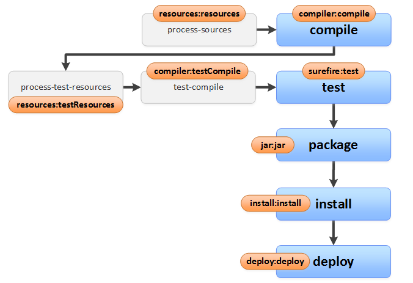

# Introducción a Maven

Maven es una herramienta que ayuda a desarrollar un proyecto basado en el entorno de una JDK (Java, Kotlin, Xtend, Scala, Groovy, etc.)

## Funcionalidades

Maven cumple con las siguientes funciones principales que vamos a explicar en las siguientes secciones:

- Reificación de Proyecto / Artefacto en forma standard, declarativa y extensible
- Manejo de Dependencias
- Manejo del Ciclo de Vida del Artefacto, incluyendo releases

## Reificación de Proyecto/Artefacto

**Reificar**: tratar un proceso o una propiedad como si fuera una cosa. En el contexto del diseño es encontrar una abstracción y darle entidad.

Java no trabaja la idea de proyecto, no lo representa como concepto. Entonces, cada uno de los IDEs pensados para Java agregan su propia forma de definirlo: en el caso de Eclipse tenemos

- el archivo .classpath que define los directorios donde compilar y las dependencias que necesita
- el archivo .project que contiene el nombre del proyecto, entre otras cosas

Si nosotros trabajamos con otro IDE (como VSCode, IntelliJ IDEA o NetBeans) tenemos que adaptar estos archivos para generar el proyecto con sus dependencias adecuadamente.

Entonces llega Maven al rescate que permite trabajar entre IDEs con su propio modelo de proyecto, que se guarda en el archivo pom.xml (de Project Object Model)

### Identificación de un proyecto Maven

En el archivo pom se declaran, entre otras cosas, un identificador único de nuestro proyecto/artefacto, que resulta de la unión de tres identificadores:

- groupId: representa la organización autora/dueña del artefacto. Por ejemplo, los proyectos de Obj2 suelen usar el groupId **ar.edu.unahur.obj2**.
- artifactId: este campo define el nombre por el que se conoce al proyecto en sí mismo. Algunos ejemplos: gesion_proyecto, simulador_vehiculo, etc.
- versión: es el último componente del rompecabezas, dado que groupId:artifactId denota un único proyecto pero no alcanza para definir en qué versión del proyecto nos estamos parando. Se agrega entonces un número de versión para completar la información que Maven necesita para generar una identificación unívoca. Conviene seguir las reglas de versionado semántico, para liberar versiones productivas. A veces se suele acompañar de un sufijo RELEASE (para versiones estables) o SNAPSHOT (para versiones intermedias que pueden estar sujetas a cambios)
  A continuación un ejemplo básico.

```

<?xml version="1.0" encoding="UTF-8"?>
<project xmlns="http://maven.apache.org/POM/4.0.0"
         xmlns:xsi="http://www.w3.org/2001/XMLSchema-instance"
         xsi:schemaLocation="http://maven.apache.org/POM/4.0.0 http://maven.apache.org/xsd/maven-4.0.0.xsd">
    <modelVersion>4.0.0</modelVersion>

    <groupId>ar.edu.unahur.obj2.tdd</groupId>
    <artifactId>caja_fuerte</artifactId>
    <version>1.0-SNAPSHOT</version>
</project>

```

Cuando se publica un componente, se empaquetan todas las clases compiladas (.class) en un archivo comprimido que tiene la extensión .jar (de Java Archive). Opcionalmente podemos tener un archivo comprimido extra con los fuentes.

### Repositorios Maven

Un repositorio Maven es un lugar donde están los artefactos Maven, estructurados en cierta forma estándar para hacer las descargas de las dependencias. Cuando instalamos Maven, se crea un repositorio Maven local en una carpeta que por defecto suele ser USER_HOME/.m2. donde USER_HOME es el directorio raiz del usuario, en windows por ejemplo C:\Users\BO60018. Si queremos ubicar al componente cuyo identificador es org.eclipse.xtend:org.eclipse.xtend.core:2.21.0.M1 podremos encontrarlo localmente en

```
%M2_HOME%/repository
└──
  └──ar
    └── edu
      └── unahur
        └── obj2
          └──tdd
            └──caja_fuerte
              └─ 1.0-SNAPSHOT --> dentro de esta carpeta estará el .jar
```

- recordemos que el identificador de un componente se arma a partir del groupId + el artifactId + la versión
- se suele exportar como variable la carpeta HOME/.m2 con el nombre M2_HOME
- en M2_HOME puede haber opcionalmente un archivo settings.xml que veremos más adelante
- en la subcarpeta repository están todos los componentes que descargamos localmente

Vemos un git de ejemplo hay que explorar los directorios incluyendo los que son ocultos, y navegar a partir de la carpeta de usuario.m2:


repo maven local

### Relacionando proyectos maven desde el POM

Es posible referenciar a otros proyectos maven desde un POM, esto es muy útil para cuando necesitamos

- declarar dependencias,
- agregar plugins
  a la hora de compilar nuestro proyecto.

## Dependencias

Las dependencias se definen dentro de un tag **dependencies**:

```
<project ...>
<...>
    <dependencies>
        <dependency>
            <groupId>org.junit.jupiter</groupId>
            <artifactId>junit-jupiter-engine</artifactId>
            <version>5.12.0</version>
            <scope>test</scope>
        </dependency>
    </dependencies>
</project>
```

En este caso, estamos definiendo que nuestro proyecto tiene como pre-requisito el componente junit-jupiter-engine asociado a org.junit.jupiter.

- agregamos la dependencia en el pom,
- actualizamos el proyecto (Maven > Update project)
- y eso dispara la descarga del componente al repositorio Maven local

Al agregar una dependencia a un proyecto es posible especificar el type (por ej., jar), el scope (por ejemplo: test), y si es o no optional.

## Plugins

Los plugins de Maven no solo permiten reutilizar lógica sino que además ejecutan acciones cuando son descargados. Así funciona el núcleo central de Maven: uno de los plugins más conocidos es clean, que elimina el directorio de destino. Otro plugin conocido es Surefire, que ejecuta los tests de un proyecto basado en JDK.

Distintos proyectos maven requieren/ofrecen distintos settings al ser referenciados como plugins. Veamos un ejemplo de la configuración del plugin de Surfire:

<project ...>
<...>
<dependencies>
<...>
</dependencies>
<build>
<plugins>

<!-- Plugin de Maven Surefire para ejecutar pruebas -->
<plugin>
<groupId>org.apache.maven.plugins</groupId>
<artifactId>maven-surefire-plugin</artifactId>
<version>3.1.2</version>
<configuration>
<!-- Asegura la compatibilidad con JUnit 5 -->
<forkCount>1</forkCount>
<reuseForks>true</reuseForks>
</configuration>
</plugin>
<plugins>
</build>

Lo recomendable en cada caso es siempre revisar la documentación oficial del proyecto maven que queremos referenciar, para entender qué settings son requeridos o convenientes para nuestro proyecto.

## Dependencias transitivas

Un detalle no menor de la resolución de dependencias de maven es que también funciona para las dependencias transitivas.

Por ejemplo:

- proyectoA –> proyectoB
- proyectoB –> proyectoC
- proyectoC –> proyectoD, proyectoE, proyectoF

Al resolver las dependencias, el proyectoA necesitará descargar los componentes B, C, D, E y F. Incluso podríamos requerir diferentes versiones de los mismos componentes.

Noten que un proyecto comercial “normal” o mediano, puede incluir decenas y hasta cientos de dependencias.

## Flujo general de descarga de componentes

A continuación mostraremos el algoritmo que utiliza Maven para encontrar las dependencias de nuestro proyecto: si no lo tenemos en nuestro repositorio local, lo irá a buscar al repositorio Maven Central, y en última instancia, en los repositorios adicionales definidos por nuestro proyecto o la configuración general de Maven (el archivo settings.xml).


## Ejecutando maven desde la consola

Una alternativa es trabajar directamente con Maven desde la consola, algo que puede ser útil para automatizar tareas, como cuando trabajemos con herramientas de integración continua.

```
mvn clean compile
```

Esto ejecuta varios plugins en forma sincronizada:

- por un lado borra los directorios de destino,
- y luego compila los fuentes del proyecto, lo cual implica descargarse las dependencias y luego compilar de .java .class

Si queremos ver el árbol de dependencias transitivas, podemos escribir

```
mvn dependency:tree
```

Pero ¿cómo sabemos qué comando debemos ejecutar? Para eso hay que entender el ciclo de vida de un build de Maven.

## Ciclos de build

Maven está pensado para todo el ciclo de vida del proyecto. Lo vamos a usar para compilar, para generar código (de ser necesario), para correr los tests, para empaquetar, y hasta para publicar nuestros artefactos generando releases con trazabilidad.

Maven define un conjunto de etapas en la construcción (build) de nuestro proyecto. Resumimos algunas acá:

- generate-sources: generar código, previo a compilación.
- compile: compila el código fuente.
- test: ejecuta los test cases
- package: genera un paquete con el código (.jar por ejemplo)
- install: hace público el paquete en nuestro repositorio local (ver repositorios locales en las siguiente sección)
- deploy: publica el artefacto en un repositorio remoto (ver repositorios locales en las siguiente sección)
  Podemos indicar a Maven que ejecute hasta cierta fase. Por ejemplo:

```
mvn compile
```

Va a ejecutar las dos primeras fases.

```
mvn test
```

Las tres primeras. Es decir es igual a mvn compile + correr los tests.

## Relación entre plugins y ciclos del build

A continuación dejamos un diagrama básico que muestra la relación entre plugin y el ciclo de vida del build:



## Documentación oficial

Para más información recomendamos leer la documentación oficial del proyecto Maven:

- [POM reference](https://maven.apache.org/pom.html)
- [Introduction to the POM](https://maven.apache.org/guides/introduction/introduction-to-the-pom.html)

Y estos links:

- [Maven in 5 minutes](https://maven.apache.org/guides/-getting-started/maven-in-five-minutes.html)
- [Simple Explanation of Maven - video de la Universidad de Cincinnati](https://www.youtube.com/watch?v=KNGQ9JBQWhQ&ab_channel=BrandanJones)
